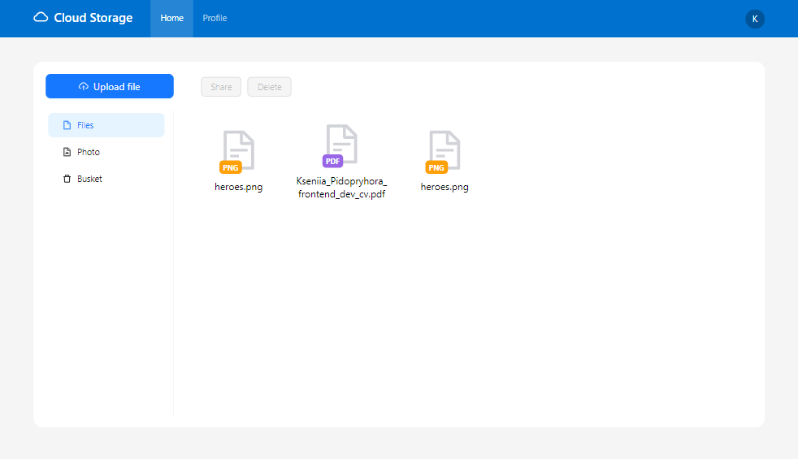

# Cloud storage | NestJS + NextJS

Click [here](https://youtu.be/Qq9C_xl2JnA) to see how it works! Click [here](https://github.com/ksalpern/cloud-storage-nest) to see the backend code!

## Key Features:
🔐 Authentication/Registration System: Users can securely register and authenticate to access their cloud storage.

👥 User Profiles: Each user gets a personalized profile to manage their storage and preferences.

⬆️ File Uploads, Deletions, and Retrieval: Seamlessly upload, delete, and retrieve files from the cloud storage, providing a hassle-free experience.

📁 Navigation Tabs: Convenient navigation tabs such as Files, Photos, and Trash enable users to organize and manage their stored content efficiently.

🚀 Custom Decorators in NestJS: Leveraging the power of NestJS, I've implemented custom decorators to enhance the functionality and extensibility of the app.

📚 Server-side Documentation using Swagger: Comprehensive server-side documentation generated by Swagger ensures seamless integration and easy API exploration.

🗃️ Database Integration with PostgreSQL and TypeORM: Efficient data storage and retrieval achieved through seamless integration with PostgreSQL and TypeORM.
